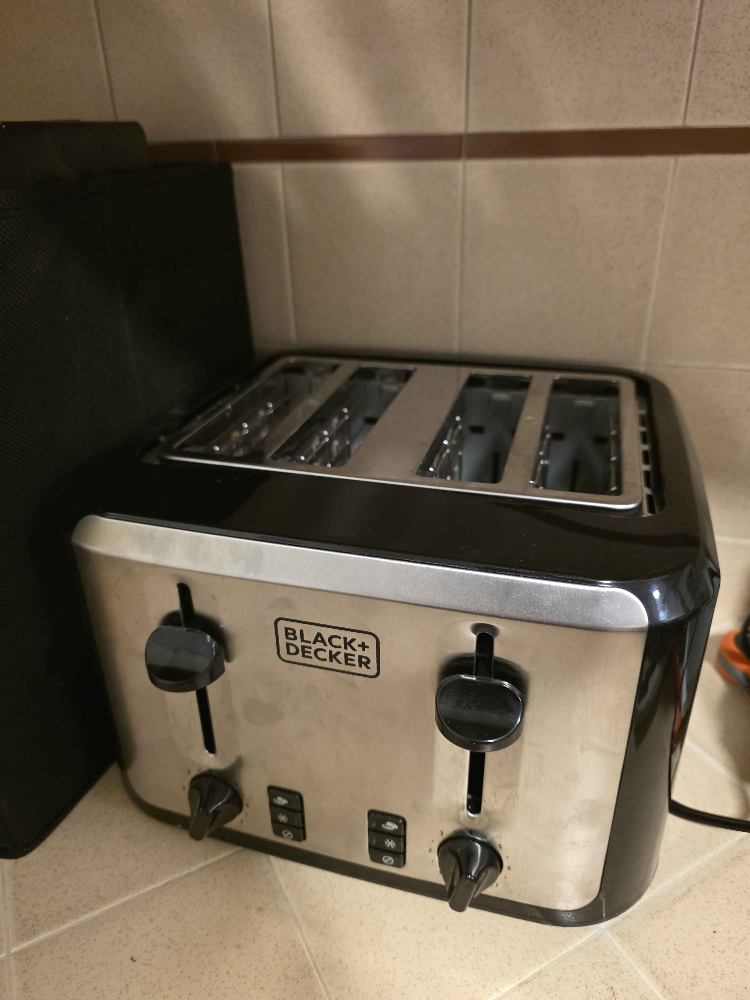
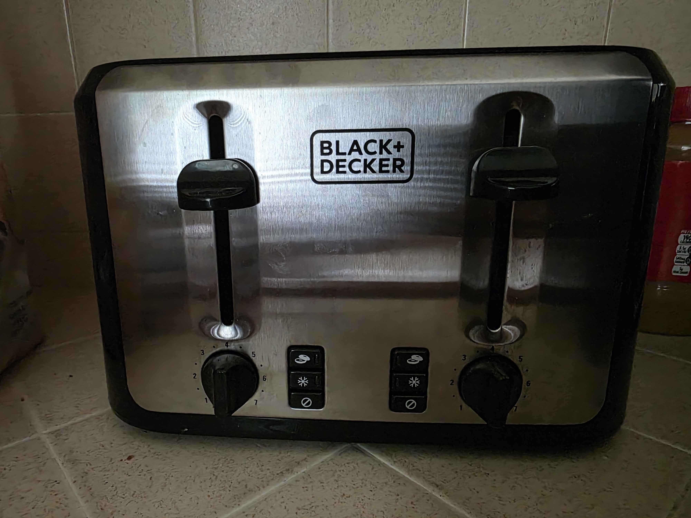
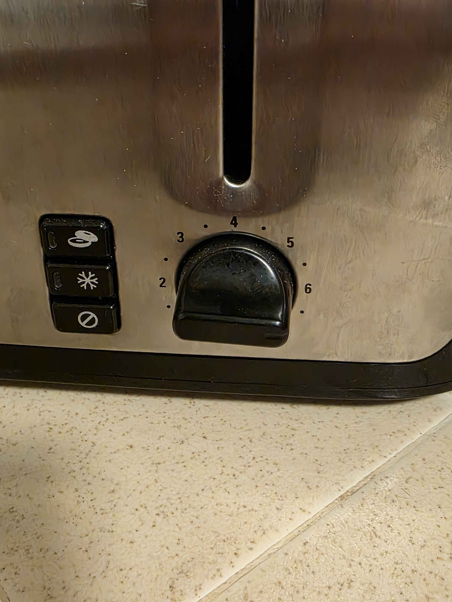

# Journal 1

## The not-so-fun experience of running my toaster.

I feel like this might be a stretch, but I haven't run into any new tech recently that had much of an obvious issue with it. So for my journal I chose to write about using my toaster. I haven't really used my toaster much, and after just moving to a new apartment, I decided to take it out of storage and give it a go in my day-to-day life. My goal for this journal was to make a single piece of toast.

Walking up to the toaster, you see this:

As it stands, walking up to the toaster, without context, it may seem a little odd for how to operate it. It is a pretty learnable design and intuitively similar to other toaster designs. On the top is some holes that are the size of bread pieces, so to me this maps pretty well. I can very clearly guess where I need to place the bread in order for it to get toasted. After placing the bread into the slot, I am now trying to figure out what to do in order to toast my bread. So I look at the front and see this:

After inspecting the front, I see there is some handles that look like they slide up or down which lowers or rasies the bread into the machine. I lower the bread down into the machine in preperation to toast the bread and it starts to toast the bread on accident. It seems that the bread instantly starts to cook the second you lower it down. By design this can save time from an extra button press, but may confuse some. I then look a little lower to see that there is a knob with a number setting on it. Which you can see here:

toaster dial:

I try to turn the knob to what I think is 6 and let the bread cook. After some time it dings and the bread pops up. The bread was under cooked, so I assume that the knob was facing the wrong direction. I twist it the other way to 6 and try again. Now I have accidentally burned my bread. The indication of where the knob is facing is not intuitive and is hard to see in the dark

